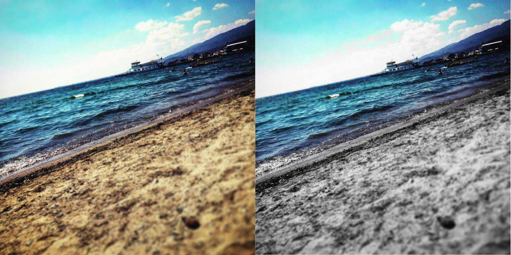

# Color Splash
Color Splash provides you to achieve color splash effect as known as selective color effect in your images. 

## Description
You can generate color splash effect with Color Splash.While you are doing this, you can grayscale, color filter or invert colors rest of the image.Here are some example images created by Color Splash.

### Examples

 

### Screenshots

## Built With
- C# 
- Windows Forms

## Getting Started

### Prerequisites
- Windows OS
### Installing
You can download the latest version from [here](https://github.com/aeren108/color_splash/releases/download/v1.1/Color_Splash.exe).

## Authors
- [@aeren108](https://github.com/aeren108)

## License
This project is licensed under the MIT License, see the LICENSE.md file for details.
